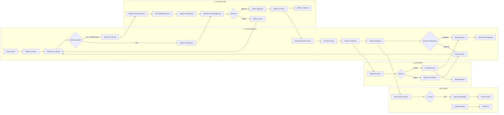

# Margins ID Quote-to-Cash Process Flow

This document describes the end-to-end process flow for the Margins ID Systems quoting and invoicing application, from initial quote creation through to revenue recognition.

---

## Key Actors (Swim Lanes)

| Actor | Role | Responsibilities |
|-------|------|------------------|
| **Salesperson** | `sales` | Creates quotes, manages customer relationships, sends invoices, tracks acceptance |
| **Controller** | `controller` | Prices sourced items, approves/rejects invoices, manages inventory, generates reports |
| **Customer** | External | Receives invoices, accepts or rejects, makes payments |
| **System** | Automated | Triggers stale invoice checks, deducts inventory, logs activities |

---

## Invoice Status Lifecycle

```
┌─────────────────┐
│     DRAFT       │ (Quote is being edited, not submitted)
└────────┬────────┘
         │ Submit for Approval
         ▼
┌─────────────────┐     Has sourced items      ┌─────────────────┐
│ PENDING APPROVAL│◄──────────────────────────►│ PENDING PRICING │
└────────┬────────┘     (needs pricing)        └────────┬────────┘
         │ Approve                                       │ Price Items
         │                                               │
         │◄──────────────────────────────────────────────┘
         ▼
┌─────────────────┐
│    APPROVED     │ (Ready to Send to Customer)
└────────┬────────┘
         │ Send to Customer (Email/Download)
         ▼
┌─────────────────────┐
│ AWAITING ACCEPTANCE │
└────────┬────────────┘
         │
    ┌────┴────┐
    ▼         ▼
┌────────┐ ┌──────────────────┐
│ACCEPTED│ │CUSTOMER REJECTED │
└───┬────┘ └────────┬─────────┘
    │               │ Revise Quote
    │               │ (Restores Inventory)
    │               ▼
    │         ┌─────────┐
    │         │  DRAFT  │ (Back to editing)
    │         └─────────┘
    ▼
┌─────────────────┐
│CUSTOMER ACCEPTED│ (Revenue Recognized)
└────────┬────────┘
         │ Record Payment
         ▼
┌─────────────────┐
│      PAID       │
└─────────────────┘
```

---

## Horizontal Swim Lane Flowchart



---

## Detailed Process Steps

### Phase 1: Quote Creation (Salesperson)

| Step | Action | Component | Status Change |
|------|--------|-----------|---------------|
| 1.1 | Login to Sales Dashboard | `SalesAnalyticsDashboard` | - |
| 1.2 | Click "Create Quote" | `QuotingModule` | - |
| 1.3 | Search and select customer | Customer dropdown | - |
| 1.4 | Add inventory items to quote | Item catalog | - |
| 1.5 | Add sourced/custom items (optional) | Custom item form | - |
| 1.6 | Set order charges (shipping, handling, discount) | Charges section | - |
| 1.7 | Preview quote | `PreviewModal` | - |
| 1.8 | Submit for approval | `handleSubmitForApproval()` | → `Pending Approval` or `Pending Pricing` |

### Phase 2: Pricing (Controller) - *If Required*

| Step | Action | Component | Status Change |
|------|--------|-----------|---------------|
| 2.1 | View pending pricing queue | `SalesInvoiceApproval` (isController) | - |
| 2.2 | Open invoice editor | `InvoiceEditor` | - |
| 2.3 | Set cost price for sourced items | Cost input fields | - |
| 2.4 | Apply markup/margin | Pricing controls | - |
| 2.5 | Save and submit | Save button | `Pending Pricing` → `Pending Approval` |

### Phase 3: Approval (Controller/Salesperson)

| Step | Action | Component | Status Change |
|------|--------|-----------|---------------|
| 3.1 | View pending approval queue | `SalesInvoiceApproval` | - |
| 3.2 | Review invoice details | `SalesInvoiceReview` | - |
| 3.3 | Select approval signature | Signature dropdown | - |
| 3.4a | **Approve** invoice | `handleApproval('Approved')` | `Pending Approval` → `Approved` |
| 3.4b | **Reject** invoice | `handleApproval('Rejected')` | `Pending Approval` → `Rejected` |
| 3.5 | System deducts inventory (on approval) | `QuoteService.approveInvoice()` | Stock decremented |

### Phase 4: Distribution (Salesperson)

| Step | Action | Component | Status Change |
|------|--------|-----------|---------------|
| 4.1 | View "Ready to Send" invoices | `MyInvoices` (readyToSend tab) | - |
| 4.2 | Click "Send to Customer" | Preview button | - |
| 4.3 | Generate PDF / Send Email | `PreviewModal` | - |
| 4.4 | System marks as sent | `markAsSentToCustomer()` | `Approved` → `Awaiting Acceptance` |

### Phase 5: Customer Response (Salesperson records)

| Step | Action | Component | Status Change |
|------|--------|-----------|---------------|
| 5.1 | View "Awaiting Acceptance" invoices | `MyInvoices` (awaitingAcceptance tab) | - |
| 5.2a | **Customer Accepts** | `handleMarkAccepted()` | `Awaiting Acceptance` → `Customer Accepted` |
| 5.2b | **Customer Rejects** | `handleMarkRejected()` | `Awaiting Acceptance` → `Customer Rejected` |
| 5.3 | If rejected: Inventory is restored | Batch update | Stock incremented |
| 5.4 | If rejected: Optionally revise quote | `handleRevise()` | `Customer Rejected` → `Draft` |

### Phase 6: Revenue Recognition & Payment

| Step | Action | Component | Status Change |
|------|--------|-----------|---------------|
| 6.1 | View "Realized Revenue" invoices | `MyInvoices` (realizedRevenue tab) | - |
| 6.2 | Record payment (if applicable) | Payment recording | `Customer Accepted` → `Paid` |

---

## Automated System Processes

### Stale Invoice Detection
- **Trigger**: On salesperson login
- **Condition**: Invoices in `Awaiting Acceptance` status for > 7 days
- **Action**: Display `StaleInvoiceModal` prompting action
- **Component**: `GlobalStaleCheck`

### Inventory Management
- **On Approval**: Stock is **decremented** atomically
- **On Customer Rejection**: Stock is **restored**
- **On Quote Revision**: Stock is **restored**

### Audit Logging
All key actions are logged to `audit_logs` collection:
- Quote creation
- Invoice status changes
- Approval/Rejection events
- Customer responses
- Payment recording

---

## Decision Points Summary

| Decision Point | Options | Outcome |
|---------------|---------|---------|
| Items need pricing? | Yes → `Pending Pricing` | No → `Pending Approval` |
| Approval decision? | Approve → `Approved` | Reject → `Rejected` |
| Customer response? | Accept → `Customer Accepted` | Reject → `Customer Rejected` |
| Stale invoice action? | Accept/Reject/Remind | Status updated accordingly |

---

## System Components Reference

| Page/Component | Primary User | Purpose |
|----------------|--------------|---------|
| `QuotingModule` | Sales | Create and configure quotes |
| `SalesInvoiceApproval` | Sales/Controller | Approve or reject invoices |
| `SalesInvoiceReview` | Sales/Controller | Detailed invoice review |
| `InvoiceEditor` | Controller | Price sourced items, edit invoices |
| `MyInvoices` | Sales | Manage own invoices through lifecycle |
| `AllInvoices` | Controller | View all invoices in system |
| `CustomerPortal` | Sales | View customer-specific invoice history |
| `PreviewModal` | Sales | Generate PDF, send email |
| `GlobalStaleCheck` | System | Detect and prompt for stale invoices |

---

## Currency Handling

- **Base Currency**: GHS (Ghanaian Cedi)
- **Alternate Currency**: USD (US Dollar)
- **Exchange Rate**: Stored per invoice at creation time
- **Display Logic**: Prices converted dynamically based on selected currency

---

## Data Flow Diagram

```
┌──────────────┐     ┌──────────────┐     ┌──────────────┐
│   Customers  │     │   Inventory  │     │    Taxes     │
│  Collection  │     │  Collection  │     │  Settings    │
└──────┬───────┘     └──────┬───────┘     └──────┬───────┘
       │                    │                    │
       └────────────────────┼────────────────────┘
                            │
                            ▼
                   ┌────────────────┐
                   │    INVOICES    │
                   │   Collection   │
                   └────────┬───────┘
                            │
           ┌────────────────┼────────────────┐
           │                │                │
           ▼                ▼                ▼
    ┌────────────┐   ┌────────────┐   ┌────────────┐
    │ Audit Logs │   │ Signatures │   │  Payments  │
    └────────────┘   └────────────┘   └────────────┘
```
